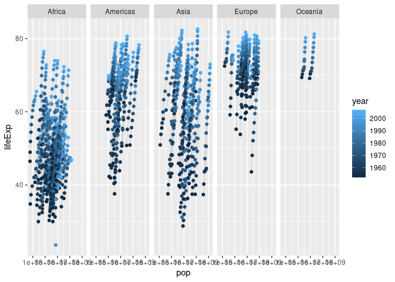

Workshop \#3: Data Visualization with ggplot2
================
BEPHIG
2021-04-08

Notes on the previous workshop are available
[here](https://github.com/bephig/bephig/tree/main/02_data-wrangling).

# Getting started

If you haven’t done so already, please install `tidyverse` by using the
function `install.packages()`. Once installed, attach the packages.

``` r
library(tidyverse)
```

    ## ── Attaching packages ─────────────────────────────────────── tidyverse 1.3.0 ──

    ## ✓ ggplot2 3.3.3     ✓ purrr   0.3.4
    ## ✓ tibble  3.1.0     ✓ dplyr   1.0.5
    ## ✓ tidyr   1.1.3     ✓ stringr 1.4.0
    ## ✓ readr   1.4.0     ✓ forcats 0.5.1

    ## ── Conflicts ────────────────────────────────────────── tidyverse_conflicts() ──
    ## x dplyr::filter() masks stats::filter()
    ## x dplyr::lag()    masks stats::lag()

In addition to the packages that you’ve worked with in the past (namely
`dplyr` and `readr`), this command also attaches `ggplot2`, which is the
focus of this workshop.

# Accessing data for visualization

As stated in the previous workshop, you’d normally be importing your own
data (in the form of a spreadsheet or a CSV file) into R using commands
such as `readxl::read_xlsx()` or `readr::read_csv()`. But to ensure that
you can follow along with the instructions provided here, let’s install
the `gapminder` package using the function `install.packages()` then
attach it using `library()`.

``` r
library(gapminder)
```

You can then use `?gapminder` to pull up the documentation if you have
any questions about what you’ve just installed.

Briefly, `gapminder` is both a package and a tibble (recall that a
tibble is, for our purposes, a fancier data frame). You can inspect
`gapminder` like you would any other data frame:

``` r
head(gapminder) # first few rows
```

    ## # A tibble: 6 x 6
    ##   country     continent  year lifeExp      pop gdpPercap
    ##   <fct>       <fct>     <int>   <dbl>    <int>     <dbl>
    ## 1 Afghanistan Asia       1952    28.8  8425333      779.
    ## 2 Afghanistan Asia       1957    30.3  9240934      821.
    ## 3 Afghanistan Asia       1962    32.0 10267083      853.
    ## 4 Afghanistan Asia       1967    34.0 11537966      836.
    ## 5 Afghanistan Asia       1972    36.1 13079460      740.
    ## 6 Afghanistan Asia       1977    38.4 14880372      786.

``` r
tail(gapminder) # last few rows
```

    ## # A tibble: 6 x 6
    ##   country  continent  year lifeExp      pop gdpPercap
    ##   <fct>    <fct>     <int>   <dbl>    <int>     <dbl>
    ## 1 Zimbabwe Africa     1982    60.4  7636524      789.
    ## 2 Zimbabwe Africa     1987    62.4  9216418      706.
    ## 3 Zimbabwe Africa     1992    60.4 10704340      693.
    ## 4 Zimbabwe Africa     1997    46.8 11404948      792.
    ## 5 Zimbabwe Africa     2002    40.0 11926563      672.
    ## 6 Zimbabwe Africa     2007    43.5 12311143      470.

``` r
View(gapminder)
```

You can also learn more about the data types found under each column
using the function `str()`:

``` r
str(gapminder)
```

    ## tibble[,6] [1,704 × 6] (S3: tbl_df/tbl/data.frame)
    ##  $ country  : Factor w/ 142 levels "Afghanistan",..: 1 1 1 1 1 1 1 1 1 1 ...
    ##  $ continent: Factor w/ 5 levels "Africa","Americas",..: 3 3 3 3 3 3 3 3 3 3 ...
    ##  $ year     : int [1:1704] 1952 1957 1962 1967 1972 1977 1982 1987 1992 1997 ...
    ##  $ lifeExp  : num [1:1704] 28.8 30.3 32 34 36.1 ...
    ##  $ pop      : int [1:1704] 8425333 9240934 10267083 11537966 13079460 14880372 12881816 13867957 16317921 22227415 ...
    ##  $ gdpPercap: num [1:1704] 779 821 853 836 740 ...

Based on the output of this single command, you now know that: - There
are 1,704 columns and 6 rows - The first column contains the names of
142 countries organized alphabetically from Afghanistan to Zimbabwe -
The second column contains the continent to which these countries belong
- The third column contains the year during which the data were
collected - The fourth column contains data on life expectancy - The
fifth column contains data on population size - The sixth column
contains data on the Gross Domestic Product per capita

Again, you can verify these claims by checking the documentation.

# Preparing the data for visualizationq

Gapminder is unique in that you can call for the data frame without
having it exist in your environment (check the panes to see what is
currently in your environment if you’re using RStudio or use the
function `ls()`). To get used to the practice of assigning values (here,
a data frame) to the environment for use in the future, assign
`gapminder` to your environment.

``` r
gm <- gapminder
```

Now, instead of typing gapminder over and over again, you can type `gm`
instead,

# Getting started with ggplot2

There are countless different resources out there to learn ggplot2. The
intention of this workshop is to get acquainted with this package so
you’ll have some familiarity when looking things up on the internet.

First, let’s consider what to plot. Let’s try plotting a factor against
numeric data (e.g., country against life expectancy).

First, start with `ggplot()` to initiate a new plot and supply the data
(`gm`) as its argument.

``` r
ggplot(gm)
```

<!-- -->

If you’re using RStudio, you should see a blank plot somewhere on your
screen. Think of this as the empty canvas for your future figure. Let’s
assign this canvas to the environment. You will see why this is useful
later.

``` r
p <- ggplot(gm)
```

Next, let’s plot life expectancy on the x-axis and the corresponding
countries on the y-axis. There are many ways to achieve the same goal
(i.e., plot the same figure) using ggplot2. One way is to map the
aesthetics (i.e., the columns in `gm`) when specifying the type of
figure that you want to produce. To illustrate, let’s add a layer
(“geom”) to our empty canvas, `p`:

``` r
p + geom_point(aes(x = lifeExp, y = country))
```

<!-- -->

Oh no\! This doesn’t look useful at all. The reasons should be obvious:
- There are a lot of countries represented in this figure (resulting in
the barely legible y-axis) - There are multiple times at which life
expectancy was recorded for each country and it’s impossible to know if
there is a trend over time or population size

Let’s address the first of these two these issues by: - Choosing a year
to compare the different countries - Sampling a handful of countries
instead of plotting data from all 142 countries included in this data
set

In order to accomplish these tasks, you will have to do some data
wrangling with `dplyr`. Let’s choose 25 countries at random.

``` r
set.seed(2021) # this ensures reproducibility of our "random" sampling
(countries_sampled <- sample(unique(gm$country), 25))
```

    ##  [1] United States    Yemen, Rep.      Korea, Dem. Rep. Philippines     
    ##  [5] Saudi Arabia     Kenya            Poland           Puerto Rico     
    ##  [9] Chad             Libya            Sweden           Syria           
    ## [13] Gabon            Portugal         Colombia         Djibouti        
    ## [17] Peru             Morocco          Cote d'Ivoire    Serbia          
    ## [21] Pakistan         Cambodia         Jordan           Somalia         
    ## [25] Tunisia         
    ## 142 Levels: Afghanistan Albania Algeria Angola Argentina Australia ... Zimbabwe

Let’s also find out the year with the most recent data on life
expectancy across all of these 25 countries.

``` r
max_year <- gm %>% 
  filter(country %in% countries_sampled,
         !is.na(lifeExp)) %>%  # technically not needed; there are no missing values in this data set
  group_by(country) %>% 
  summarize(max_year = max(year)) %>% 
  pull(max_year) %>%
  unique()
max_year
```

    ## [1] 2007

The most recent life expectancy data is from 2007 for all 25 countries.
With this knowledge, let’s create a new data frame that contains only
the data from these 25 countries corresponding to the year 2007.

``` r
gm_filtered <- gm %>% 
  filter(country %in% countries_sampled,
         year == max_year)
```

Use `View()` to inspect this data frame. It looks to be much more
manageable in size\!

``` r
View(gm_filtered)
```

Since the data being supplied to ggplot has changed, you will need a new
canvas:

``` r
p <- ggplot(gm_filtered, aes(x = lifeExp, y = country))
p
```

<!-- -->

As can be seen here, the canvas won’t be entirely blank if the plot
aesthetics are specified in the first step (i.e., as an argument to
`ggplot`). This can also reduce the amount of redundancy later on when
specifying each additional layer to be added to the canvas since each
geom “inherits” these aesthetics if left unspecified.

``` r
p1 <- p + geom_point()
p1
```

<!-- -->

This is an improvement in that it is legible and not overwhelming in
terms of data. However, this is not a useful visualization of the data
because the levels of the factor were arranged alphabetically:

``` r
levels(gm_filtered$country)
```

    ##   [1] "Afghanistan"              "Albania"                 
    ##   [3] "Algeria"                  "Angola"                  
    ##   [5] "Argentina"                "Australia"               
    ##   [7] "Austria"                  "Bahrain"                 
    ##   [9] "Bangladesh"               "Belgium"                 
    ##  [11] "Benin"                    "Bolivia"                 
    ##  [13] "Bosnia and Herzegovina"   "Botswana"                
    ##  [15] "Brazil"                   "Bulgaria"                
    ##  [17] "Burkina Faso"             "Burundi"                 
    ##  [19] "Cambodia"                 "Cameroon"                
    ##  [21] "Canada"                   "Central African Republic"
    ##  [23] "Chad"                     "Chile"                   
    ##  [25] "China"                    "Colombia"                
    ##  [27] "Comoros"                  "Congo, Dem. Rep."        
    ##  [29] "Congo, Rep."              "Costa Rica"              
    ##  [31] "Cote d'Ivoire"            "Croatia"                 
    ##  [33] "Cuba"                     "Czech Republic"          
    ##  [35] "Denmark"                  "Djibouti"                
    ##  [37] "Dominican Republic"       "Ecuador"                 
    ##  [39] "Egypt"                    "El Salvador"             
    ##  [41] "Equatorial Guinea"        "Eritrea"                 
    ##  [43] "Ethiopia"                 "Finland"                 
    ##  [45] "France"                   "Gabon"                   
    ##  [47] "Gambia"                   "Germany"                 
    ##  [49] "Ghana"                    "Greece"                  
    ##  [51] "Guatemala"                "Guinea"                  
    ##  [53] "Guinea-Bissau"            "Haiti"                   
    ##  [55] "Honduras"                 "Hong Kong, China"        
    ##  [57] "Hungary"                  "Iceland"                 
    ##  [59] "India"                    "Indonesia"               
    ##  [61] "Iran"                     "Iraq"                    
    ##  [63] "Ireland"                  "Israel"                  
    ##  [65] "Italy"                    "Jamaica"                 
    ##  [67] "Japan"                    "Jordan"                  
    ##  [69] "Kenya"                    "Korea, Dem. Rep."        
    ##  [71] "Korea, Rep."              "Kuwait"                  
    ##  [73] "Lebanon"                  "Lesotho"                 
    ##  [75] "Liberia"                  "Libya"                   
    ##  [77] "Madagascar"               "Malawi"                  
    ##  [79] "Malaysia"                 "Mali"                    
    ##  [81] "Mauritania"               "Mauritius"               
    ##  [83] "Mexico"                   "Mongolia"                
    ##  [85] "Montenegro"               "Morocco"                 
    ##  [87] "Mozambique"               "Myanmar"                 
    ##  [89] "Namibia"                  "Nepal"                   
    ##  [91] "Netherlands"              "New Zealand"             
    ##  [93] "Nicaragua"                "Niger"                   
    ##  [95] "Nigeria"                  "Norway"                  
    ##  [97] "Oman"                     "Pakistan"                
    ##  [99] "Panama"                   "Paraguay"                
    ## [101] "Peru"                     "Philippines"             
    ## [103] "Poland"                   "Portugal"                
    ## [105] "Puerto Rico"              "Reunion"                 
    ## [107] "Romania"                  "Rwanda"                  
    ## [109] "Sao Tome and Principe"    "Saudi Arabia"            
    ## [111] "Senegal"                  "Serbia"                  
    ## [113] "Sierra Leone"             "Singapore"               
    ## [115] "Slovak Republic"          "Slovenia"                
    ## [117] "Somalia"                  "South Africa"            
    ## [119] "Spain"                    "Sri Lanka"               
    ## [121] "Sudan"                    "Swaziland"               
    ## [123] "Sweden"                   "Switzerland"             
    ## [125] "Syria"                    "Taiwan"                  
    ## [127] "Tanzania"                 "Thailand"                
    ## [129] "Togo"                     "Trinidad and Tobago"     
    ## [131] "Tunisia"                  "Turkey"                  
    ## [133] "Uganda"                   "United Kingdom"          
    ## [135] "United States"            "Uruguay"                 
    ## [137] "Venezuela"                "Vietnam"                 
    ## [139] "West Bank and Gaza"       "Yemen, Rep."             
    ## [141] "Zambia"                   "Zimbabwe"

This makes it more difficult to interpret the figure on first glance.
What you could do is re-order the different levels of the factor before
plotting:

``` r
gm_filtered$country <- fct_reorder(gm_filtered$country, gm_filtered$lifeExp)
levels(gm_filtered$country)
```

    ##   [1] "Somalia"                  "Cote d'Ivoire"           
    ##   [3] "Chad"                     "Kenya"                   
    ##   [5] "Djibouti"                 "Gabon"                   
    ##   [7] "Cambodia"                 "Yemen, Rep."             
    ##   [9] "Pakistan"                 "Korea, Dem. Rep."        
    ##  [11] "Morocco"                  "Peru"                    
    ##  [13] "Philippines"              "Jordan"                  
    ##  [15] "Saudi Arabia"             "Colombia"                
    ##  [17] "Tunisia"                  "Libya"                   
    ##  [19] "Serbia"                   "Syria"                   
    ##  [21] "Poland"                   "Portugal"                
    ##  [23] "United States"            "Puerto Rico"             
    ##  [25] "Sweden"                   "Afghanistan"             
    ##  [27] "Albania"                  "Algeria"                 
    ##  [29] "Angola"                   "Argentina"               
    ##  [31] "Australia"                "Austria"                 
    ##  [33] "Bahrain"                  "Bangladesh"              
    ##  [35] "Belgium"                  "Benin"                   
    ##  [37] "Bolivia"                  "Bosnia and Herzegovina"  
    ##  [39] "Botswana"                 "Brazil"                  
    ##  [41] "Bulgaria"                 "Burkina Faso"            
    ##  [43] "Burundi"                  "Cameroon"                
    ##  [45] "Canada"                   "Central African Republic"
    ##  [47] "Chile"                    "China"                   
    ##  [49] "Comoros"                  "Congo, Dem. Rep."        
    ##  [51] "Congo, Rep."              "Costa Rica"              
    ##  [53] "Croatia"                  "Cuba"                    
    ##  [55] "Czech Republic"           "Denmark"                 
    ##  [57] "Dominican Republic"       "Ecuador"                 
    ##  [59] "Egypt"                    "El Salvador"             
    ##  [61] "Equatorial Guinea"        "Eritrea"                 
    ##  [63] "Ethiopia"                 "Finland"                 
    ##  [65] "France"                   "Gambia"                  
    ##  [67] "Germany"                  "Ghana"                   
    ##  [69] "Greece"                   "Guatemala"               
    ##  [71] "Guinea"                   "Guinea-Bissau"           
    ##  [73] "Haiti"                    "Honduras"                
    ##  [75] "Hong Kong, China"         "Hungary"                 
    ##  [77] "Iceland"                  "India"                   
    ##  [79] "Indonesia"                "Iran"                    
    ##  [81] "Iraq"                     "Ireland"                 
    ##  [83] "Israel"                   "Italy"                   
    ##  [85] "Jamaica"                  "Japan"                   
    ##  [87] "Korea, Rep."              "Kuwait"                  
    ##  [89] "Lebanon"                  "Lesotho"                 
    ##  [91] "Liberia"                  "Madagascar"              
    ##  [93] "Malawi"                   "Malaysia"                
    ##  [95] "Mali"                     "Mauritania"              
    ##  [97] "Mauritius"                "Mexico"                  
    ##  [99] "Mongolia"                 "Montenegro"              
    ## [101] "Mozambique"               "Myanmar"                 
    ## [103] "Namibia"                  "Nepal"                   
    ## [105] "Netherlands"              "New Zealand"             
    ## [107] "Nicaragua"                "Niger"                   
    ## [109] "Nigeria"                  "Norway"                  
    ## [111] "Oman"                     "Panama"                  
    ## [113] "Paraguay"                 "Reunion"                 
    ## [115] "Romania"                  "Rwanda"                  
    ## [117] "Sao Tome and Principe"    "Senegal"                 
    ## [119] "Sierra Leone"             "Singapore"               
    ## [121] "Slovak Republic"          "Slovenia"                
    ## [123] "South Africa"             "Spain"                   
    ## [125] "Sri Lanka"                "Sudan"                   
    ## [127] "Swaziland"                "Switzerland"             
    ## [129] "Taiwan"                   "Tanzania"                
    ## [131] "Thailand"                 "Togo"                    
    ## [133] "Trinidad and Tobago"      "Turkey"                  
    ## [135] "Uganda"                   "United Kingdom"          
    ## [137] "Uruguay"                  "Venezuela"               
    ## [139] "Vietnam"                  "West Bank and Gaza"      
    ## [141] "Zambia"                   "Zimbabwe"

The levels of the factor `country` are now organized by increasing life
expectancy in the year 2007. The countries that have been filtered out
follow the first 25 and remain organized in alphabetical order. It may
help to drop these unused levels to mitigate future risk of problems.

``` r
gm_filtered$country <- droplevels(gm_filtered$country)
levels(gm_filtered$country)
```

    ##  [1] "Somalia"          "Cote d'Ivoire"    "Chad"             "Kenya"           
    ##  [5] "Djibouti"         "Gabon"            "Cambodia"         "Yemen, Rep."     
    ##  [9] "Pakistan"         "Korea, Dem. Rep." "Morocco"          "Peru"            
    ## [13] "Philippines"      "Jordan"           "Saudi Arabia"     "Colombia"        
    ## [17] "Tunisia"          "Libya"            "Serbia"           "Syria"           
    ## [21] "Poland"           "Portugal"         "United States"    "Puerto Rico"     
    ## [25] "Sweden"

Let’s try plotting again.

``` r
p2 <- gm_filtered %>% 
  ggplot(aes(x = lifeExp, y = country)) + 
  geom_point()
p2
```

<!-- -->

Much better, but this could still be improved. Let’s change the axis
labels to something more descriptive.

``` r
p3 <- p2 +
  xlab("Life expectancy in 2007") +
  ylab("Country") +
  theme_bw()

p3
```

<!-- -->

You can save this figure to your hard drive with the command `ggsave()`.

``` r
ggsave("life-expectancy-selected-countries.png", p3, device = "png")
```

    ## Saving 7 x 5 in image

You can supply many more arguments to specify the file type, size, and
resolution of the exported figure. See `?ggsave` for more information.

# More complicated figures

Say you wanted to visualize the average life expectancy of each
continent and each country in 2007 at the same time. Could this be done?
Let’s give it a try.

First, let’s filter the data to only the year 2007.

``` r
gm_filtered <- gm %>% 
  filter(year == 2007)
```

Then, let’s try visualizing the distribution of life expectancy by
continent using boxplots.

``` r
p <- gm_filtered %>% 
  ggplot() +
  geom_boxplot(aes(x = continent, y = lifeExp), outlier.shape = NA)
p
```

<!-- -->

Though this isn’t exactly in the right order (in terms of increasing
median life expectancy as one moves from left to right), let’s ignore
this shortcoming for the remainder of the workshop (you should be able
to figure out how to re-order the levels of the factor based on the
example above). Now, add in the individual countries:

``` r
p1 <- p +
  geom_point(aes(x = country, y = lifeExp))
p1
```

<!-- -->

Let’s try this again.

``` r
p1 <- p +
  geom_point(aes(x = continent, y = lifeExp))
p1
```

<!-- -->

The problem before was the introduction of a different aesthetic mapping
for the x-axis. It is not necessary to specify country when plotting
individual data points as this would result in the need for the scale to
accommodate both continents and countries.

`geom_boxplot` is capable of plotting the summary statistics and
`geom_point` plots the individual points (hence explaining why outliers
were purposely removed in the first example).

Additional instructions can be added to our canvas `p` to improve this
plot:

``` r
p1 <- p +
  geom_jitter(aes(x = continent, y = lifeExp), width = 0.1, alpha = 1/4)
p1
```

<!-- -->

Jittering, by a width of 0.1 in this example, helps distinguish
neighbouring points from one another. The opacity/transparency, size,
and colour of these points can also be changed to help further
differentiate these points:

``` r
p2 <- p +
  geom_jitter(aes(x = continent, y = lifeExp, size = pop, colour = pop), width = 0.1, alpha = 1/4) +
  scale_colour_viridis_c() +
  guides(colour = guide_legend(title = "population"), size = guide_legend(title = "population")) +
  ylab("life expectancy in 2007")
  
p2
```

<!-- -->

Now, let’s play around with some other variables. Perhaps it might be of
interest to examine the association between life expectancy and
population. Let’s quickly plot all of the data to explore the
relationship.

``` r
ggplot(gm) +
  geom_point(aes(y = lifeExp, x = pop))
```

<!-- -->

There seems to be some sort of pattern, but it’s hard to tell. Let’s try
to colour code these data by year.

``` r
ggplot(gm) + 
  geom_point(aes(x = pop, y = lifeExp, colour = year))
```

<!-- -->

This is not too useful. Notice how most of the data is left of
300,000,000 on the x-axis? Let’s try filtering out that data.

``` r
gm %>% 
  filter(pop < 3e8) %>% 
  ggplot() +
  geom_point(aes(x = pop, y = lifeExp, colour = year))
```

<!-- -->

Let’s take a step back to examine what was filtered out.

``` r
options(tibble.print_max = Inf) # to show all rows
print(filter(gm, pop >=3e8))
```

    ## # A tibble: 25 x 6
    ##    country       continent  year lifeExp        pop gdpPercap
    ##    <fct>         <fct>     <int>   <dbl>      <int>     <dbl>
    ##  1 China         Asia       1952    44    556263527      400.
    ##  2 China         Asia       1957    50.5  637408000      576.
    ##  3 China         Asia       1962    44.5  665770000      488.
    ##  4 China         Asia       1967    58.4  754550000      613.
    ##  5 China         Asia       1972    63.1  862030000      677.
    ##  6 China         Asia       1977    64.0  943455000      741.
    ##  7 China         Asia       1982    65.5 1000281000      962.
    ##  8 China         Asia       1987    67.3 1084035000     1379.
    ##  9 China         Asia       1992    68.7 1164970000     1656.
    ## 10 China         Asia       1997    70.4 1230075000     2289.
    ## 11 China         Asia       2002    72.0 1280400000     3119.
    ## 12 China         Asia       2007    73.0 1318683096     4959.
    ## 13 India         Asia       1952    37.4  372000000      547.
    ## 14 India         Asia       1957    40.2  409000000      590.
    ## 15 India         Asia       1962    43.6  454000000      658.
    ## 16 India         Asia       1967    47.2  506000000      701.
    ## 17 India         Asia       1972    50.7  567000000      724.
    ## 18 India         Asia       1977    54.2  634000000      813.
    ## 19 India         Asia       1982    56.6  708000000      856.
    ## 20 India         Asia       1987    58.6  788000000      977.
    ## 21 India         Asia       1992    60.2  872000000     1164.
    ## 22 India         Asia       1997    61.8  959000000     1459.
    ## 23 India         Asia       2002    62.9 1034172547     1747.
    ## 24 India         Asia       2007    64.7 1110396331     2452.
    ## 25 United States Americas   2007    78.2  301139947    42952.

It would seem that China and India had exceeded the threshold every year
that these data were collected. The US only exceed that threshold in the
last year the data were collected.

Maybe it makes sense to exclude China and India, but not the US, for
visualization purposes.

``` r
gm %>% 
  filter(country != "China" & country != "India") %>% 
  ggplot() +
  geom_point(aes(x = pop, y = lifeExp, colour = year))
```

<!-- -->

What else can we do with this data? We could join data from the same
country together in a smooth curve

``` r
gm %>% 
  filter(country != "China" & country != "India") %>% 
  ggplot() + 
  geom_point(aes(x = pop, y = lifeExp, colour = year)) +
  stat_smooth(aes(x = pop, y = lifeExp, group = country), geom = "line", alpha = 0.1, se = F)
```

    ## `geom_smooth()` using method = 'loess' and formula 'y ~ x'

<!-- -->

Again, this is still a mess, but there seems to be an upward trajectory
between life expectancy and population size for most countries. Is there
a good way to include data from China and India without having the
smoothed curves of these two countries displaced far to the right of all
other curves? Let’s try re-scaling our x-axis:

``` r
gm %>% 
  ggplot() + 
  geom_point(aes(x = pop, y = lifeExp, colour = year)) +
  stat_smooth(aes(x = pop, y = lifeExp, group = country), geom = "line", alpha = 0.1, se = F) +
  scale_x_log10()
```

    ## `geom_smooth()` using method = 'loess' and formula 'y ~ x'

<!-- -->

Let’s also try separating these curves by continent. This can be
accomplished using `facet_grid()`:

``` r
gm %>% 
  ggplot() + 
  geom_point(aes(x = pop, y = lifeExp, colour = year)) +
  stat_smooth(aes(x = pop, y = lifeExp, group = country), geom = "line", alpha = 0.1, se = F) +
  scale_x_log10() +
  facet_grid(.~continent)
```

    ## `geom_smooth()` using method = 'loess' and formula 'y ~ x'

<!-- -->

If you were more interested in trends over time (as opposed to trends
over population size), give this a try:

``` r
gm %>% 
  ggplot() + 
  stat_smooth(aes(x = year, y = lifeExp, group = country), geom = "line", alpha = 0.1, se = F) +
  facet_grid(.~continent)
```

    ## `geom_smooth()` using method = 'loess' and formula 'y ~ x'

<!-- -->

We can even try averaging life expectancy at the different years on top
of this figure.

``` r
suppl <- gm %>% 
  group_by(continent, year) %>% 
  summarize(mean_lifeExp = mean(lifeExp))
```

    ## `summarise()` has grouped output by 'continent'. You can override using the `.groups` argument.

``` r
View(suppl)

ggplot() + 
  stat_smooth(aes(x = year, y = lifeExp, group = country), geom = "line", alpha = 0.1, se = F,
              data = gm) +
  stat_smooth(aes(x = year, y = mean_lifeExp), geom = "line", alpha = 1, colour = "red", se = F,
              data = suppl) +
  facet_grid(.~continent) +
  theme_bw()
```

    ## `geom_smooth()` using method = 'loess' and formula 'y ~ x'

    ## `geom_smooth()` using method = 'loess' and formula 'y ~ x'

<!-- -->

Notice how this last figure used data from two separate sources (i.e.,
`gm` and `suppl`) and had different aesthetic mappings for the two
layers added to the canvas? This demonstrates the flexibility afforded
by `ggplot2` when used for data visualization and exploration.

# Summary

The `ggplot2` package is a great way to explore data. It is
well-supported by a dedicated community and free-to-use. Moreover, the
figures are readily reproducible if you have access to both the code and
the data sets.

Until next time\!
